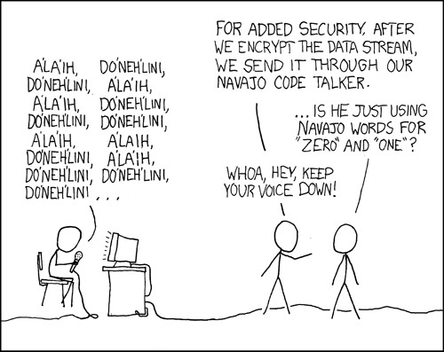
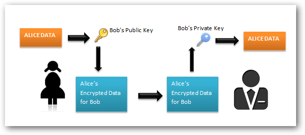
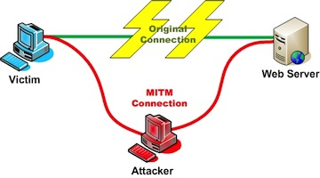
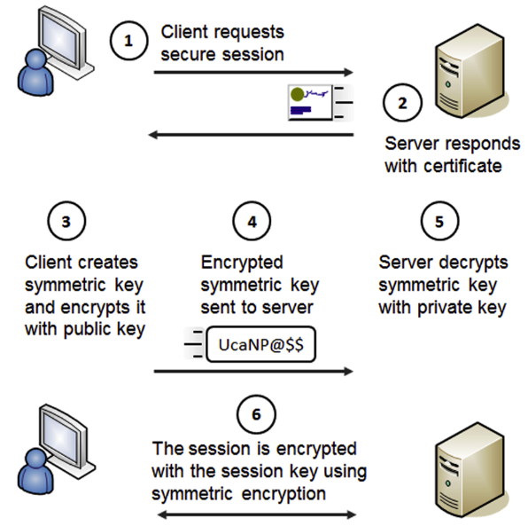

# Securing The Web

---

# Agenda

* Secure Sockets Layer (SSL)
* Transport Layer Security (TLS)
* HTTPS

---

# What Is Encryption?  

---

# Asymmetric Encryption

**Asymmetric encryption** or **public-key cryptography** uses a separate key for
encryption and decryption.

Anyone can use the encryption key (public key) to encrypt a message.

However, decryption keys (private keys) are secret.

The most common asymmetric encryption algorithm is **RSA**.

---

# Symmetric Encryption

**Symmetric encryption** or **pre-shared key encryption** uses a single key to both
encrypt and decrypt data.

Both the sender and the receiver need the same key to communicate.

**The larger the key size, the harder the key is to crack**.

Popular symmetric algorithms: Blowfish, AES, Twofish.

---

# SSL

---

# Secure Socket Layer (SSL)

Protocol developed by Netscape Communications Corporation.

Provide **security** and **privacy** over the Internet.

Maintains the security and **integrity** of the transmission channel by using
**encryption**, **authentication** and **message authentication codes**.

Use **asymmetric encryption** techniques to generate a shared secret key, which
avoids the key distribution problem.

It's all about **authentication**, **privacy**, and **integrity**.

### Versions

* `1.0` developed by Netscape, never publicly released;
* `2.0` released in February 1995, but contained some security flaws;
* `3.0` released in 1996, [RFC 6101](http://tools.ietf.org/html/rfc6101).

---

# Authentication

During both client and server authentication there is a step that requires data
to be encrypted with one of the keys in an **asymmetric key pair** and decrypted
with the other key of the pair.

### In a nutshell

1. Generate a key pair (public and private key)
2. Use a X.509 certificate to wrap public key
3. Exchange CA-signed public keys

---

# Certificate Authority (CA)

An **entity** that issues digital certificates.

It's a **trusted third party** that is trusted by both the subject (owner) of
the certificate and the party relying upon the certificate.

When server presents certificate to client during SSL handshake, client will
attempt to verify signature against a list of **known good signers**.

Web browsers normally come with lists of CAs that they will implicitly trust to
identify hosts.

If the authority is not in the list, as with some sites that sign their own
certificates, the browser will alert the user that the certificate is not signed
by a recognized authority and ask the user if they wish to continue
communications with unverified site.

Well-known Certificate Authorities: Comodo, GeoTrust, or **VeriSign**.

---

# Privacy

The SSL client and SSL server agree an **encryption algorithm** and a shared
secret key to be used for one session only.

All messages transmitted between the SSL client and SSL server are encrypted
using that algorithm and key, ensuring that the message remains private even if
it is intercepted.

Symmetric algorithms supported in SSL are: DES, 3DES, ARCFOUR, AES, Camellia,
RC2, IDEA, SEED, NULL (no encryption).

---

# Integrity

SSL provides data integrity by calculating a message digest (fingerprinting).

**Message integrity** refers to maintaining and assuring the accuracy and
consistency of the message.

---

# SSL Handshake

<small>Source: [An overview of the SSL
handshake](http://publib.boulder.ibm.com/infocenter/wmqv6/v6r0/topic/com.ibm.mq.csqzas.doc/sy10660_.htm)</small>

---

# TLS

---

# Transport Layer Security (TLS)

Cryptographic protocol that provides communication security over the Internet.

**I**nternet **E**ngineering **T**ask **F**orce (IETF) standard, described in
[RFC 5246](http://tools.ietf.org/html/rfc5246), and based on SSL.

Implemented on top of the **Transport Layer**.

Composed of two layers:

* the **TLS Record Protocol**;
* the **TLS Handshake Protocol**.

### Versions

* `1.0` released in January 1999, [RFC 2246](http://tools.ietf.org/html/rfc2246);
* `1.1` released in April 2006, [RFC 4346](http://tools.ietf.org/html/rfc4346);
* `1.2` released in August 2008, [RFC 5246](http://tools.ietf.org/html/rfc5246).

---

# Transport Layer Security (TLS)

### TLS Record Protocol

Negotiate a private, reliable connection between the client and the server.

Use symmetric cryptography keys to ensure a **private** connection.
This connection is secured through the use of hash functions generated by
Message Authentication Code.

### TLS Handshake Protocol

Allow the server and the client to speak the same language, with a determined
encryption algorithm and determined encryption keys.

Use the same handshake protocol procedure as SSL.

### SSL vs TLS

TLS is the new name for SSL. Namely, SSL protocol got to version 3.0.

TLS 1.0 is "SSL 3.1".

---

# 

.fx: no-border

---

# The Heartbleed Bug

The Heartbleed Bug is a **serious vulnerability** in the popular **OpenSSL**
cryptographic software library.

This weakness allows **stealing the information protected**, under normal
conditions, by the SSL/TLS encryption used to secure the Internet. SSL/TLS
provides communication security and privacy over the Internet for applications
such as web, email, instant messaging (IM) and some virtual private networks
(VPNs).

> More information at: [http://heartbleed.com/](http://heartbleed.com/)

---

# HTTPS

---

# HTTP + SSL/TLS = HTTPS

---

# Hypertext Transfer Protocol Secure

The main idea of HTTPS is to create a **secure channel over an insecure
network**.

HTTPS URLs begin with `https://` and use port `443` by default, whereas HTTP
URLs begin with `http://` and use port `80` by default.

HTTPS encrypts and decrypts user page requests as well as the pages that are
returned by the web server.
The use of HTTPS protects against **eavesdropping** and **man-in-the-middle**
attacks:

---

# HTTPS: The Big Picture

---

# No Excuse Not To Use HTTPS!

 
 

 
 

* Free certificates for everyone: [letsencrypt.org](https://letsencrypt.org/)
* TLS does not impact performances negatively: [istlsfastyet.com](https://istlsfastyet.com/)

.fx: no-border
